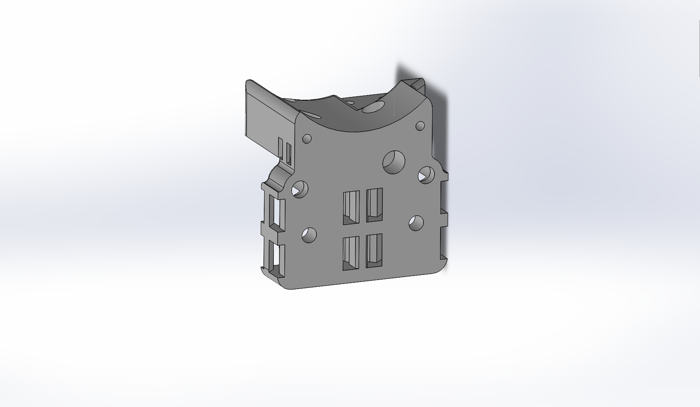
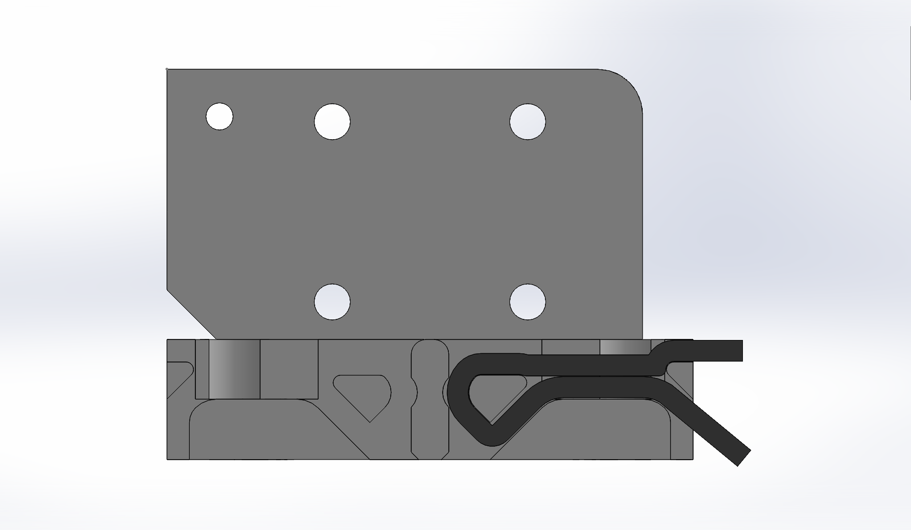
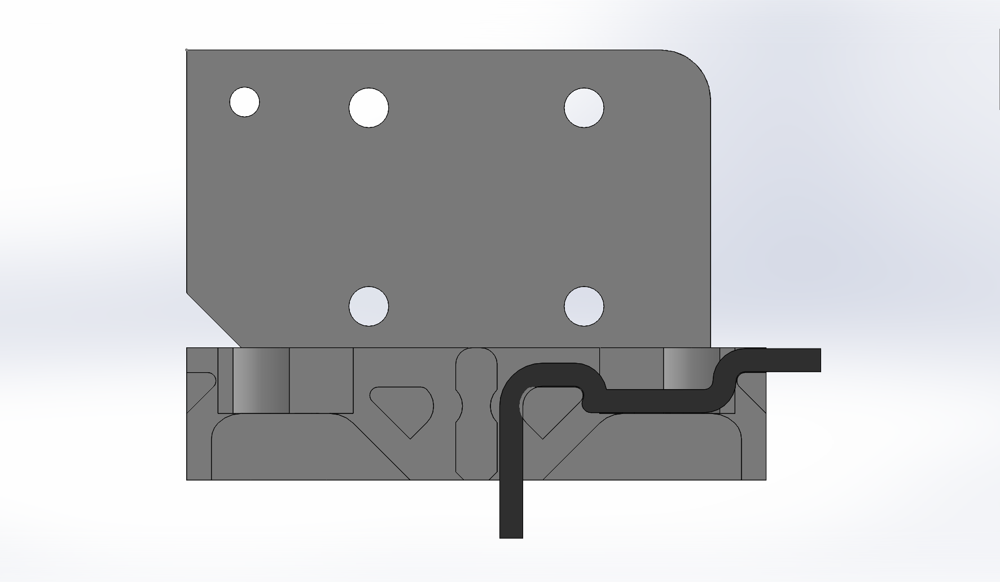
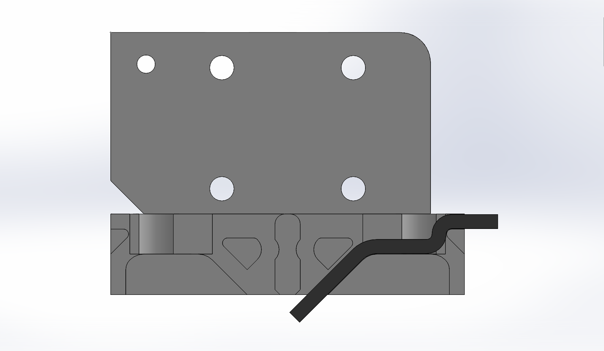
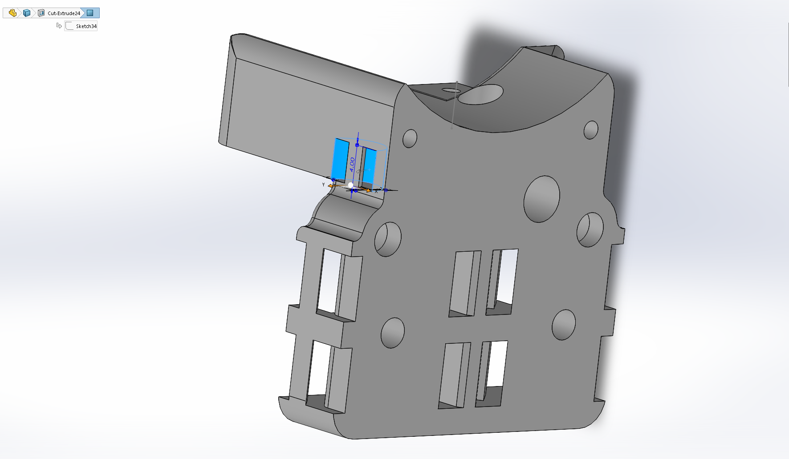

MaybeEasier V0 X-Carriage
===================================

This replaces the X-carriage on the V0 with one that is maybe easier to use, but most definitely more easily reusable if you've had to pull the carriage off after trimming the belts. Because this gives you the option to route the belt three different ways, you can mount things in the way you like best. Additionally the zip-tie holes are a bit larger than the current stock model, allowing the use of the more common "4-inch" or "100mm" zipties.

I did this because I wanted a little more belt available for when I needed to change the x-carriage and not spend an hour futzing with disassembly-- a little more belt made that easy!

Essentially, this carriage lets you route the excess belt out to the side or diagonal to the side/front in addition to the option of putting the excess out the middle.

Overview:

Routing the excess belt out the side, so you can have a more easily resuable belt

An alternate belt routing that is close to the default.

Another alternate belt routing that has the belt angling inward at the center.

Required hardware
-----------------

There is no additional required hardware-- other than printing some new plastic, you can just reuse the stock parts.
